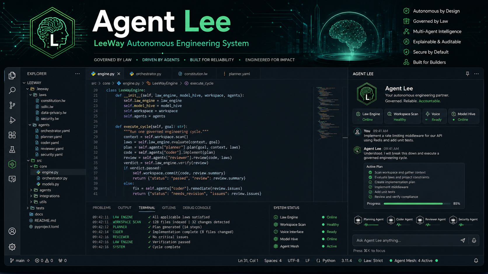
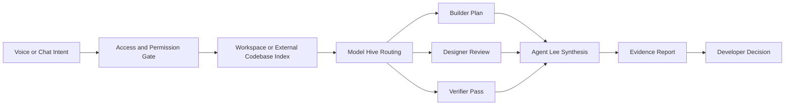

<!--
LEEWAY_HEADER - DO NOT REMOVE

REGION: CORE
TAG: CORE.DOCUMENTATION.README.MAIN
DISCOVERY_PIPELINE: Voice -> Intent -> Location -> Vertical -> Ranking -> Render
-->

# Agent Lee - LeeWay Autonomous Engineering System

<!--
LEEWAY FILE DESIGN - DO NOT REMOVE

COLOR_ONION_HEX:
NEON=#39FF14
FLUO=#0DFF94
PASTEL=#C7FFD8
ABYSS=#050816

ICON_ASCII:
family=lucide
glyph=brain-circuit

5WH:
WHAT = Agent Lee product README and developer onboarding guide
WHY = Demonstrates the VS Code assistant, safety model, workflow, and verification gates
WHO = Leonard Lee / Agent Lee LeeWay Runtime
WHERE = .leeway-vscode/README.md
WHEN = 2026
HOW = Markdown-native interactive guide with LeeWay governance metadata

AGENTS:
PRIME, DOCTOR, AUDIT, ALIGN, VERIFY

LICENSE:
MIT
-->

<p align="center">
  
</p>

<p align="center">
  <strong>Agent Lee is a governance-first VS Code engineering assistant with chat, voice, web search, codebase access, model routing, and proof-first verification.</strong>
</p>

<p align="center">
  <a href="#try-agent-lee"><strong>Try Agent Lee</strong></a>
  &nbsp;|&nbsp;
  <a href="#how-the-workflow-runs"><strong>Workflow</strong></a>
  &nbsp;|&nbsp;
  <a href="#safety-model"><strong>Safety</strong></a>
  &nbsp;|&nbsp;
  <a href="#developer-controls"><strong>Controls</strong></a>
  &nbsp;|&nbsp;
  <a href="#verification"><strong>Verification</strong></a>
</p>

<p align="center">
  
  
  
  
</p>

---

## Try Agent Lee

Agent Lee is installed as a VS Code extension and opens as a chat-first sidebar. The main chat surface keeps the controls developers actually need at the input rail:

| Control | Purpose |
| :--- | :--- |
| `Access` | Approve a workspace or external codebase folder for inspection. |
| `Safe / Balanced / Full Auto` | Choose the permission level for reads, edits, and inline completion. |
| `Model` | Select the active local model during the chat process. |
| `Web` | Toggle web search for current docs, product pages, and research tasks. |
| `Mic` | Dictate to Agent Lee through the VS Code webview. |
| `Send` | Submit the governed request. |

```powershell
cd .\agent-lee-leeway-coding-system\vscode-extension
npm install
npm run compile
npx @vscode/vsce package -o agent-lee-1.1.0-sovereign-runtime.vsix
code --install-extension .\agent-lee-1.1.0-sovereign-runtime.vsix --force
```

Reload VS Code, then open Agent Lee from the Activity Bar, the status bar, or the Command Palette command:

```txt
Agent Lee: Open Chat
```

---

## How The Workflow Runs

<p align="center">
  
</p>



<details>
<summary><strong>1. Intent enters through chat or voice</strong></summary>

Agent Lee accepts typed prompts, dictated prompts, file paths, folder paths, URLs, and codebase comparison requests. The first speaker and final speaker are always Agent Lee; worker models stay internal.

</details>

<details>
<summary><strong>2. Access is checked before inspection</strong></summary>

The extension reads the open VS Code workspace by default. External directories require explicit approval through the `Access` control or a VS Code approval prompt when a path appears in chat.

</details>

<details>
<summary><strong>3. The codebase is indexed before advice</strong></summary>

Agent Lee walks the project, ignores generated runtime output, prioritizes product source files, and samples the codebase before producing implementation guidance.

</details>

<details>
<summary><strong>4. The model hive works behind the scenes</strong></summary>

Builder, Designer/UX, Verifier, and synthesis roles can use different local models. The chat rail still lets the developer switch the active model at any time.

</details>

<details>
<summary><strong>5. Verification produces evidence</strong></summary>

For front-end work, Agent Lee can produce repair reports, browser inspection output, accessibility notes, screenshots, and workflow evidence under `reports/`.

</details>

---

## Safety Model

Agent Lee is designed to be useful without becoming reckless. Safety is not an afterthought; it is part of the runtime law.

| Layer | What It Protects | How It Works |
| :--- | :--- | :--- |
| LeeWay metadata | File ownership and discovery | Governed files carry `LEEWAY_HEADER`, `REGION`, `TAG`, and `DISCOVERY_PIPELINE`. |
| Permission modes | Developer control | `Safe`, `Balanced`, and `Full Auto` control how far Agent Lee can go. |
| External access gate | Local filesystem privacy | External paths require explicit approval before inspection. |
| Law engine | Dangerous actions | Unsafe patterns such as force-push-to-main or core overwrite requests are blocked. |
| Drift guard | Runtime stability | Repeated runtime errors trigger drift tracking and review behavior. |
| Proof-first reports | Reviewability | Repairs and front-end checks write evidence paths for developer inspection. |
| Local model runtime | Data boundary | Model calls route through local Ollama by default. |

<details>
<summary><strong>Permission modes</strong></summary>

`Safe` is for read-first guidance and low-risk inspection.

`Balanced` allows deeper project analysis while keeping high-impact actions gated.

`Full Auto` enables aggressive assistance such as inline completions and broader autonomous workflow behavior. This mode should be used intentionally.

</details>

<details>
<summary><strong>What Agent Lee refuses</strong></summary>

Agent Lee blocks requests that would bypass governance, destroy project state, force push directly to protected branches, overwrite core files without review, or produce a non-Agent-Lee final speaker response.

</details>

---

## Developer Controls

The visible chat controls are intentionally small. Everything else lives in Settings.

| Surface | What Belongs There |
| :--- | :--- |
| Chat rail | Access, permission mode, model, web search, mic, send. |
| Settings | Builder/Designer/Verifier model hive, voice status, browser options, evidence path. |
| Onboarding | First-run model selection. |
| Command Palette | Open chat, open sidebar, new chat, stop voice, install editor tooling. |

### Model Hive

Agent Lee can route internal work across local models:

- Builder Model: implementation planning and code generation.
- Designer/UX Model: layout, hierarchy, accessibility, and polish review.
- Verifier Model: syntax, risk, regression, and LeeWay compliance pass.

You can still choose the active chat model directly beside the input box during the conversation.

---

## Codebase Access

Agent Lee should be able to reason across the open workspace and other local products when you approve them.

```txt
Example prompt:
Compare this workspace against C:\Users\Leona\Products\Another-LeeWay-App and tell me where the architecture diverges.
```

What happens:

1. Agent Lee detects the path.
2. VS Code asks for approval if that path is not already approved.
3. Agent Lee indexes the target folder, ignoring generated output such as `node_modules`, `out`, `logs`, and `reports`.
4. The model hive receives summarized project context for comparison.
5. Agent Lee answers as one governed speaker.

---

## Verification

Run the doctor script to prove the extension is buildable, packageable, and LeeWay compliant.

```powershell
.\test-extension.ps1 -Build -Package -CheckOllama
```

Expected result:

```txt
Failed checks: 0
LeeWay compliance: 100%
TypeScript compile succeeds
VSIX package builds
Ollama API reachable
```

Latest successful report path:

```txt
reports/doctor-*/AGENT_LEE_DOCTOR.md
```

---

## Architecture Snapshot

```txt
.leeway-vscode/
  agent-lee/
    scripts/                 # Build, install, doctor, compliance repair
    safety/                  # Local governance helpers
    voice/                   # Voice runtime and Piper wiring
    mcp/                     # Capability registry
  agent-lee-leeway-coding-system/
    vscode-extension/
      src/                   # VS Code extension runtime
      media/                 # Activity Bar and README imagery
      out/                   # Compiled extension output
  workspace/
    agents/                  # Agent index folders
  reports/                   # Doctor, repair, browser, and validation evidence
```

---

## LeeWay Principles

| Principle | Meaning |
| :--- | :--- |
| Law Over Intelligence | Intelligence operates inside governance, not outside it. |
| One Final Speaker | Worker models do not fragment the user experience. |
| Proof Before Trust | Reports and checks matter more than claims. |
| Local First | Local code and local models are the default boundary. |
| Developer Control | Access, model choice, web mode, voice, and permissions stay visible. |

---

## Author

**Leonard Lee**  
Freelance Full-Stack Developer and AI Systems Architect  
GitHub: [4citeB4U](https://github.com/4citeB4U)

---

## Final Statement

> Code is not just written. It is governed, verified, and maintained. Agent Lee keeps the loop visible.

# .LEEWAY-VACODE
