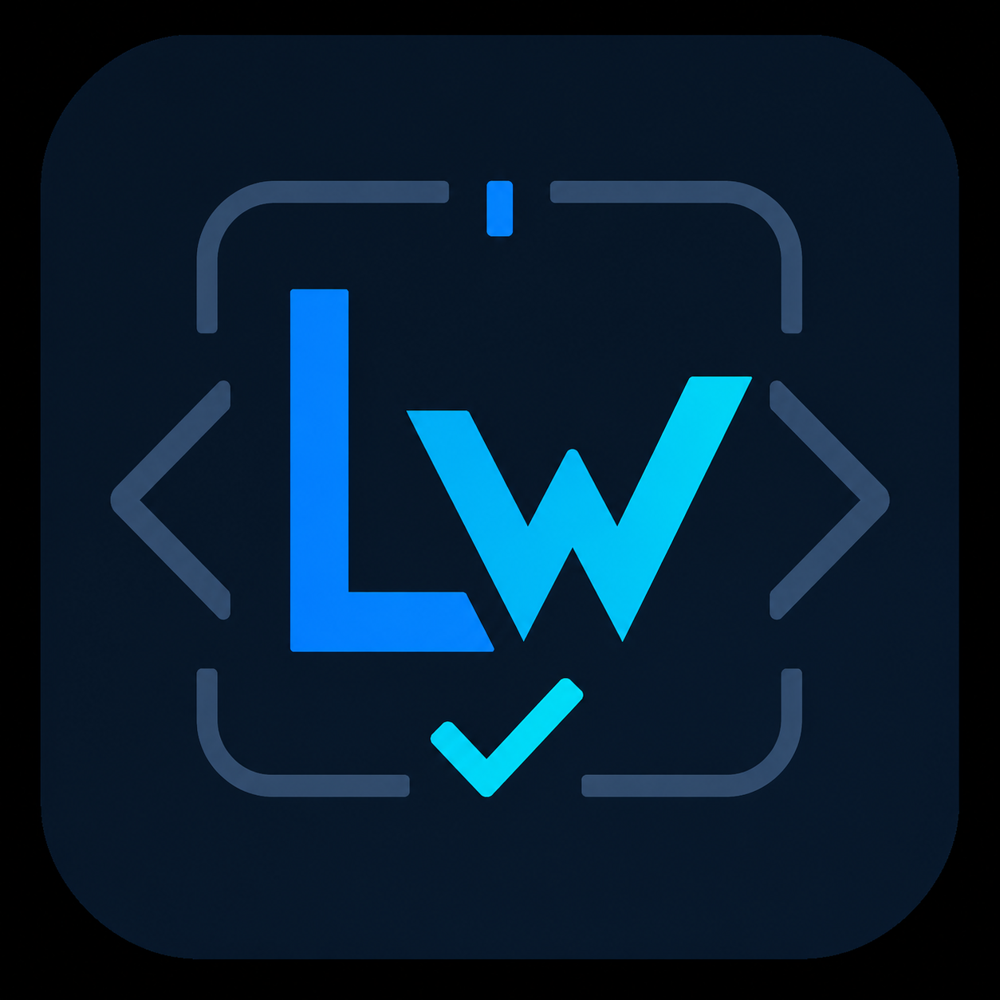

<!--
LEEWAY_HEADER - DO NOT REMOVE

REGION: CORE
TAG: CORE.README
DISCOVERY_PIPELINE: Voice -> Intent -> Location -> Vertical -> Ranking -> Render
-->

# 🧠 Agent Lee — LeeWay Autonomous Engineering System

/*
LEEWAY HEADER — DO NOT REMOVE

REGION: 🟢 CORE
TAG: CORE.DOCUMENTATION.README.MAIN

COLOR_ONION_HEX:
NEON=#39FF14
FLUO=#0DFF94
PASTEL=#C7FFD8

ICON_ASCII:
family=lucide
glyph=brain-circuit

5WH:
WHAT = Agent Lee System README
WHY = Definitive governance and operational manual for the LeeWay Autonomous Engineering System
WHO = Leonard Lee (Sovereign Architect)
WHERE = .leeway-vscode/README.md
WHEN = 2026
HOW = Markdown-orchestrated governance documentation

AGENTS:
ASSESS, ALIGN, AUDIT, DOCTOR, PRIME

LICENSE:
MIT
*/

<p align="center">
  
</p>

---

## 📘 Overview

**Agent Lee** is a **LeeWay Standards–compliant, governance-first coding system** designed to operate as a **self-regulating engineering runtime** inside Visual Studio Code and beyond.

Unlike traditional AI assistants, Agent Lee enforces strict operational law, verifies all changes against a **GOLD baseline**, and autonomously repairs system drift through controlled multi-agent workflows.

---

## âš¡ Quick Start: Using Agent Lee in VS Code

### 1. **Reload VS Code**
Press `Ctrl + Shift + P` → search for `Developer: Reload Window` → Press Enter

### 2. **Locate the Agent Lee Chat Button**

After reloading, look for **one of these:**

- 🤖 **Robot icon in left sidebar** (Activity Bar) ← **Click this for chat**
- 💬 **"$(hubot) Agent Lee" button in bottom-right corner** (Status Bar)
- Or use Command Palette: `Ctrl + Shift + P` → `Agent Lee: Open Chat`

### 3. **Start Chatting**

Simply type your question or instruction in the chat box. Agent Lee will:
- Analyze your VS Code workspace automatically
- Route your request to the right specialized agent
- Generate code, explanations, and fixes
- Maintain conversation history and memory

---

## 🧩 Core Principles: The Sovereign Law

### 1. Law Over Intelligence
All actions are governed by the **Agent Lee Law Engine**. Intelligence is secondary to compliance.
```txt
No unsafe execution is permitted under any condition.
```

### 2. GOLD-State Integrity
The system operates under a verified state:
```txt
GOLD = 100% compliant + verified + stable
```
If GOLD is lost:
*   Execution is blocked
*   Repair is triggered (Auto-Medic)
*   System restores itself before continuing

---

## ⚙️ The 8-Stage Sovereign Cycle

Every action taken by Agent Lee passes through the unbreakable 8-stage sequence:

| Stage | Name | Function |
| :--- | :--- | :--- |
| 1 | **Perception** | Environmental scanning and intent detection. |
| 2 | **Origin** | Identity verification and authorization. |
| 3 | **Structure** | Architectural alignment with LeeWay Standards. |
| 4 | **Execution** | Controlled modification or generation. |
| 5 | **Veritas** | Validation gate (Syntax, Logic, Safety). |
| 6 | **Echo** | Persistence to local ONNX/Vector memory. |
| 7 | **Synthesis** | Final consistency check and reporting. |
| 8 | **Lee Prime** | Final speaker delivery and Handoff. |

---

## 🏛️ The Core 7 Families of Agents

| Agent Name | Family | Purpose |
| :--- | :--- | :--- |
| **Agent Lee** | Prime | The Final Speaker and system-wide orchestrator. |
| **Nova** | Coding | High-fidelity code generation and logic forging. |
| **Atlas** | Memory | Manages semantic and episodic memory stores. |
| **Shield** | Security | Enforces strict governance and secret scanning. |
| **Nexus** | Routing | Central hub for agent-to-agent communication. |
| **Aura** | Media | Manages UI rendering and voice synthesis. |
| **Chronos** | Pipeline | Automates tasks and build loop execution. |

---

## 🔌 The MCP Agent Fleet (Machine Control)

| Agent Name | Category | Purpose |
| :--- | :--- | :--- |
| `frontend-mcp` | UI/UX | Frontend architecture and component scaffolding. |
| `backend-mcp` | API/Server | Backend logic and server-side API design. |
| `fs-nav-agent` | Host | Filesystem navigation (list, view, grep). |
| `mutation-agent` | Host | Physical code modification and multi-chunk editing. |
| `host-exec-agent` | Host | Native OS terminal command execution. |

---

## 🧪 System Behavior & Scenarios

| Scenario | Result | Action |
| :--- | :--- | :--- |
| **Unsafe action** | 🔴 BLOCKED | Law Engine intervention. |
| **System drift** | 🟡 REPAIR | Auto-Medic triggered. |
| **Verification fail** | 🟠 RETRY | Recursive fix loop. |
| **GOLD missing** | 🚫 HALT | Execution suspended until GOLD restored. |

---

## 🚀 Command Encyclopedia

### Terminal (CLI) Usage
```bash
# Full system boot
npm run start

# Governance & Health
leeway doctor     # Full system diagnosis
leeway audit      # Compliance scoring
leeway scan       # Security & secret scan
leeway map        # Architecture discovery
```

### Restricted Commands (Blocked by Design)
*   Force push to main
*   Overwrite system core files
*   Execute unverified patches

---

## 🎨 Color Coordination Matrix

| Token | Hex Code | Visual Reference |
| :--- | :--- | :--- |
| **Deep Background** | `#050816` | Solid Abyss |
| **Neon Accent** | `#39FF14` | LeeWay Primary |
| **Fluo Accent** | `#0DFF94` | Safety Secondary |
| **Pastel Accent** | `#C7FFD8` | Verification Soft |

---

## 👤 Author
**Leonard Lee**
*Freelance Full-Stack Developer & AI Systems Architect*
[GitHub: 4citeB4U](https://github.com/4citeB4U)

---

## 🔥 Final Statement
> "Code is not just written. It is governed, verified, and maintained. The Hive Mind is active."
# .LEEWAY-VACODE

