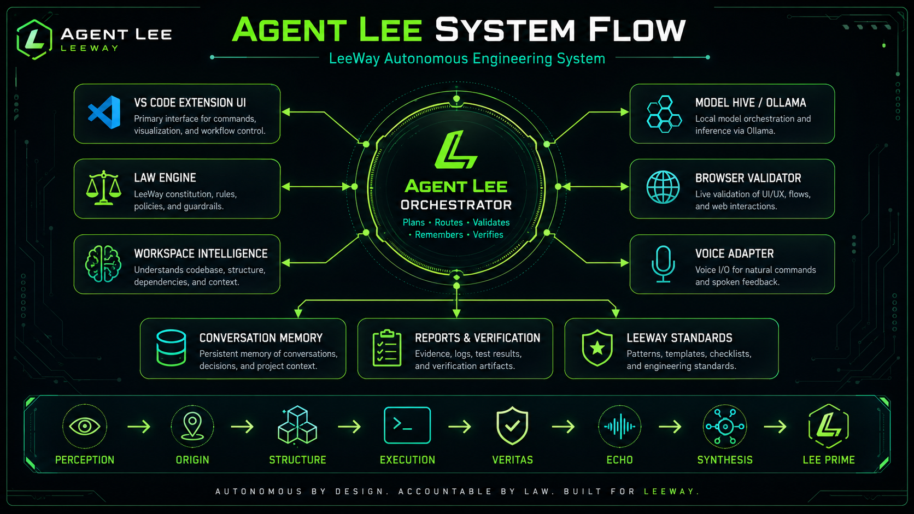
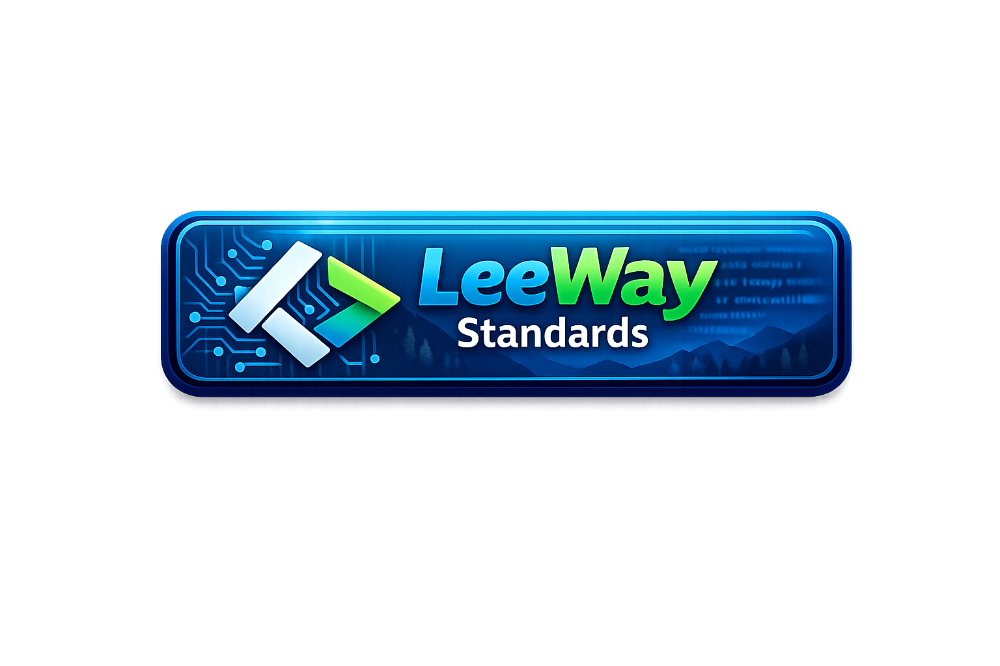

<!--
LEEWAY_HEADER - DO NOT REMOVE

REGION: CORE
TAG: CORE.REPOSITORY.README.MAIN
DISCOVERY_PIPELINE: Voice -> Intent -> Location -> Vertical -> Ranking -> Render
-->

# Agent Lee LeeWay Coding System

  

<strong>Governed AI engineering. Sovereign runtime control. Agent VM orchestration. Proof before trust.</strong>

  

From this point forward, this is the authoritative Leeway VS Code sovereign stack and governance structure for the LVIS ecosystem and related Agent Lee systems.

## Workflow Execution

Agent Lee operates via a strict governance and execution workflow:
1. **Scan workspace:** Analyze the local environment.
2. **Build context pack:** Accumulate necessary codebase knowledge.
3. **Create work package:** Structure the tasks based on user intent.
4. **Generate pending hunks:** Formulate local code edits.
5. **Show diff:** Present changes for review.
6. **Ask for approval:** Request explicit user permission.
7. **Apply with WorkspaceEdit:** Make physical changes.
8. **Verify:** Check compilation, tests, and formatting.
9. **Write receipt:** Produce audit logs.
10. **Report truthfully:** Provide a governed, sovereign response to the user.

---

## Canonical Leeway VS Code Runtime Stack

### LLMs
| Model | Role |
| :--- | :--- |
| `qwen2.5-coder:1.5b` | Lightweight routing, classification |
| `qwen2.5-coder:7b` | Coding, tool orchestration |
| `qwen2.5-coder:14b` | Coding, routing, classification, tool orchestration |
| `deepseek-coder-v2:16b` | Heavy code synthesis, multi-file reasoning |
| `llama3.1:8b` | Scene generation, structural synthesis |
| `llava:7b` | Vision understanding, image interpretation |
| `phi3:mini` | Lightweight execution tasks |
| `nomic-embed-text`| Vector memory, retrieval |
| `azr` | Reasoning, repair-loop cognition |
| `echo` | Memory, diagnostics, receipts |

---

## Canonical Agent Lineup

| Name | Family | Skills | Purpose | Job |
| :--- | :--- | :--- | :--- | :--- |
| **agent-lee-prime** | Prime | Routing, Execution | Sovereign Coordinator | Primary Sovereign Agent |
| **fs-nav-agent** | Navigator | FS Inspection | Workspace discovery | File system navigation |
| **host-exec-agent** | Executor | Shell Commands | CLI interactions | Host execution operations |
| **media-forge-agent** | Forge | Media generation | Asset generation | Media synthesis |
| **mutation-agent** | Forge | Code diffing | Writing changes | File modification |
| **perception-agent** | Intelligence | Insight generation| Vision and analysis | Perception tasks |
| **leeway-visual-orchestrator-agent**| LVIS | Visual workflows | Coordinate graphics | Visual Governance Agent |
| **shield-governor-agent** | Security | Enforcement | Block risky ops | Review protected actions |
| **attestation-marshal-agent** | Security | Verification | Agent verification | Verify identity claims |
| **memory-warden-agent** | Security | Provenance | Ledger maintenance | Protect memory states |
| **threat-sentinel-agent** | Security | Monitoring | Threat hunting | Hunt rogue workflows |

---

## Canonical MCPs

The following MCP (Model Context Protocol) plugins form the Leeway governance structure:

| MCP | Function |
| :--- | :--- |
| **leeway-agent-registry** | Agent VM registration |
| **leeway-desktop-commander** | Desktop environment bridge |
| **leeway-docs-rag** | Documentation retrieval |
| **leeway-health** | System health monitoring |
| **leeway-insforge** | Instructions forging |
| **leeway-memory** | Persistent memory ledger |
| **leeway-planner** | Task breakdown and routing |
| **leeway-playwright** | Browser automation |
| **leeway-scheduling** | Task timing and cron |
| **leeway-testsprite** | Test orchestration |
| **leeway-validation** | Governance compliance checking |
| **frontend-mcp** | Frontend execution bridge |
| **backend-mcp** | Backend execution bridge |
| **design-system-mcp** | UI design tokens bridge |
| **creative-mcp** | Visual creative execution |
| **memory-mcp** | Standard memory integration |
| **scheduler-mcp** | Time-based scheduling |
| **ui-builder-mcp** | UI components builder |
| **leeway-build-auditor-mcp** | Build auditing |
| **leeway-ci-blueprint-mcp** | CI/CD operations |
| **leeway-edge-optimizer-mcp** | Performance optimizations |
| **leeway-full-repo-checker-mcp**| Complete repo review |
| **leeway-responsive-ui-mcp** | Responsive design tasks |
| **qa-mcp** | QA validation |
| **react-native-mcp** | Mobile ecosystem integration |
| **leeway-visual-intelligence-system**| Primary LVIS framework bridge |

---

## Canonical LVIS Subsystem

LVIS = **Leeway Visual Intelligence System**

**Purpose:**
- SVG reconstruction
- voxel reconstruction
- 3D scene reconstruction
- quality verification
- repair loops
- asset packaging
- project integration
- developer-ready exports

### LVIS Objective
Transform Leeway VS Code into a sovereign visual engineering platform capable of:
- `image` &rarr; `SVG`
- `image` &rarr; `voxel`
- `SVG` &rarr; `voxel`
- `image` &rarr; `3D scene`
- `3D asset` &rarr; `React component`
- `asset` &rarr; `validated project integration`

With:
*local models, local orchestration, Leeway workers, MCP governance, deterministic reconstruction, developer-safe workflows.*

### Canonical LVIS Workers

| Worker | Role |
| :--- | :--- |
| **leeway-visual-orchestrator-agent**| Primary orchestrator |
| **leeway-vector-reconstruction-worker**| SVG and 2D shapes |
| **leeway-voxel-reconstruction-worker**| Voxelized space synthesis |
| **leeway-scene-reconstruction-worker**| 3D composition |
| **leeway-depth-synthesis-worker** | Depth analysis |
| **leeway-structural-fidelity-worker**| Quality and shape matching |
| **leeway-asset-repair-worker** | Automated refinement |
| **leeway-manifest-export-worker** | Asset bundle generation |
| **leeway-project-integration-worker**| Integration code writing |
| **leeway-visual-memory-worker** | Image and state caching |

---

## Canonical Governance Rules

**Leeway Standards:**
- schema-first
- local-first
- receipt-required
- deterministic-tools-first
- pending-edits workflow
- agent ownership
- auditability
- repair loops
- quality gates
- no blind edits

---

## Canonical Runtime Identity

| Identity Component | Assigned |
| :--- | :--- |
| **Host** | Leeway VS Code |
| **Primary Sovereign Agent** | agent-lee-prime |
| **Visual Governance Agent** | leeway-visual-orchestrator-agent |
| **Visual Subsystem** | leeway-visual-intelligence-system |

---

## Canonical Visual Intelligence Routing

  

| Engine/Model | Execution Goal |
| :--- | :--- |
| **Qwen Models** | coding, routing, classification, tool orchestration |
| **DeepSeek Coder** | heavy code synthesis, multi-file reasoning |
| **LLaVA** | vision understanding, image interpretation |
| **Llama3.1** | scene generation, structural synthesis |
| **phi3:mini** | lightweight execution tasks |
| **AZR** | reasoning, repair-loop cognition |
| **echo** | memory, diagnostics, receipts |
| **nomic-embed-text**| vector memory, retrieval |

---

## Control Surfaces

The UI is structured around governed panels inside VS Code. The correct buttons provide access to these runtime modes:

   

   
   

## Commands

| Command | Purpose |
| :--- | :--- |
| `Agent Lee: Open Chat` | Opens Agent Lee in a panel |
| `Agent Lee: Open Sidebar` | Focuses the sidebar view |
| `Agent Lee: Runtime Status` | Shows runtime readiness and proof state |
| `Agent Lee: Scan Workspace` | Runs LeeWay scanning over the workspace |
| `Agent Lee: Verify Workspace` | Performs governed verification checks |
| `Agent Lee: Ask Local Model` | Routes a direct prompt through the local model path |
| `Agent Lee: Engineer Task` | Starts a governed engineering flow |
| `Agent Lee: Stop Voice` | Stops active speech playback |
| `Agent Lee: Open README` | Opens the packaged documentation surface |

## Author

**Leonard Lee**  
Freelance Full-Stack Developer and AI Systems Architect  
GitHub: [4citeB4U](https://github.com/4citeB4U)
