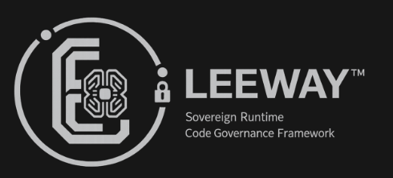

<!--
LEEWAY_HEADER - DO NOT REMOVE

REGION: CORE
TAG: CORE.AGENT_LEE.VSCODE_EXTENSION.README
PURPOSE: Runtime documentation for Agent Lee sovereign identity, capabilities, and local extension workflow.
DISCOVERY_PIPELINE: Voice -> Intent -> Location -> Vertical -> Ranking -> Render
-->

# Agent Lee LeeWay Coding System


**Agent Lee** is a governance-first VS Code engineering assistant for front-end builds, application repair, codebase inspection, browser validation, local model routing, voice I/O, and proof-first delivery.

Current packaged release in this workspace: `1.2.11`.

This extension is also the bootstrapper for LeeWay-created applications under the Paired AdminOS standard. When Agent Lee creates or governs an app, the required contract includes a public app, paired AdminOS, draft/published projection, owner education, proposal-based agents, runtime authority, security/data classification, MCP/tool governance, audit/telemetry, runtime proof, and compliance evidence.

Agent Lee persona is always-on runtime identity in this extension. The persona does not activate from a button or test command. All models, agents, tools, MCPs, command responses, and governed file writes operate under Agent Lee by default. `Agent Lee: Test Persona` is only a diagnostic probe that verifies the always-on runtime is already active.

It is not just a chat box. The extension reads the real workspace, gates external access, routes work through a local model hive, validates visual output in a browser when relevant, and leaves evidence behind in reports.


## Current Feature Surface

| Feature | What It Does |
| :--- | :--- |
| Activity Bar chat | Adds the Agent Lee sidebar in VS Code with a dedicated chat webview and runtime-health-aware sidebar launch path. |
| Status Bar launcher | Adds a bottom status bar button for opening Agent Lee quickly. |
| Command Palette actions | Provides open chat, open sidebar, open README, new chat, stop voice, and PyCharm tooling commands. |
| Workspace intelligence | Reads the open VS Code workspace and samples real project files before answering. |
| External folder approval | Detects local paths in prompts and asks before inspecting folders outside the current workspace. |
| Remote URL context | Pulls context from URLs when a prompt includes a remote target. |
| Three-model hive | Routes Builder, Designer/UX, and Verifier work to separate Ollama models. |
| Runtime model selection | Populates model dropdowns from `http://localhost:11434/api/tags`. |
| Approval modes | Supports `SAFE`, `BALANCED`, and `FULL AUTO` runtime behavior. |
| Web mode | Uses DuckDuckGo instant-answer lookup when enabled or when the prompt asks for web/latest/search context. |
| Voice output | Speaks Agent Lee responses through the configured local voice adapter. |
| Mic input | Uses VS Code webview speech recognition when available. |
| Chat history | Persists conversations and lets you switch or start a new chat. |
| Memory logs | Writes local memory/log artifacts under `.leeway-vscode/memory` and `.leeway-vscode/logs`. |
| Law engine | Blocks unsafe requests such as force-push, direct main push, bulk delete, and core overwrite actions. |
| Runtime truth | Detects whether Agent Lee is running from source, a linked workspace, a current VSIX, or a stale installed VSIX. |
| Paired AdminOS governance | Requires Paired AdminOS, draft/published projection, owner education, proposal lanes, and runtime authority for LeeWay-created public apps. |
| MCP governance | Surfaces plugin and MCP routing through governed runtime settings and proof-first receipts. |
| Scheduler and drift watch | Serializes execution and tracks repeated runtime errors as drift. |
| Capability catalog | Builds a live capability inventory from local MCP, agent, and registry sources. |
| Browser validator | Runs Playwright-based inspection for front-end and visual tasks. |
| Visual evidence | Produces screenshots, baseline images, visual diffs, browser reports, and flow reports. |
| Accessibility checks | Uses `axe-core` during browser inspection. |
| Performance and network checks | Captures load timing, requests, failed requests, missing images, broken links, console errors, and warnings. |
| Flow testing | Can execute planned browser actions and assertions for interactive UI review. |
| PyCharm tooling | Installs Agent Lee helper wiring into detected PyCharm configuration folders. |


## Interface

The main sidebar exposes the controls that matter during a real engineering session:

| Control | Purpose |
| :--- | :--- |
| Builder Model | Primary implementation and planning model. |
| Designer/UX Model | Layout, hierarchy, accessibility, and visual polish model. |
| Verifier Model | Syntax, regression, risk, and compliance review model. |
| Approval | Chooses `SAFE`, `BALANCED`, or `FULL AUTO`. |
| Web | Turns web lookup on or off. |
| Voice | Turns spoken responses on or off. |
| Visual Browser | Enables browser-backed visual inspection. |
| Show Cursor | Shows cursor movement during browser flow runs. |
| Browser slow motion | Controls browser action pacing for visible validation. |
| Mic | Dictates into the prompt field when the webview supports speech recognition. |
| History | Opens previous conversations. |
| README | Opens this README from the installed extension. |



## Commands

| Command | Purpose |
| :--- | :--- |
| `Agent Lee: Open Chat` | Opens Agent Lee in a panel. |
| `Agent Lee: Open Sidebar` | Focuses the Activity Bar sidebar view. |
| `Agent Lee: Recover UI Surface` | Force-opens the sidebar, panel, and output together. |
| `Agent Lee: Repair Installation` | Reinstalls the newest managed local VSIX and restores the UI surface. |
| `Agent Lee: Open README` | Opens the packaged README. |
| `Agent Lee: Scan Agent Lee Self` | Runs a compliance scan on the standalone runtime root. |
| `Agent Lee: Verify Agent Lee Self` | Verifies the standalone runtime root (score-gated). |
| `Agent Lee: Install PyCharm Tools` | Installs PyCharm helper tooling. |
| `Agent Lee: New Chat` | Starts a fresh conversation. |
| `Agent Lee: Stop Voice` | Stops current voice playback. |

## Local Runtime

Agent Lee expects Ollama to be available locally:

```powershell
ollama serve
ollama run qwen2.5-coder:14b
```

The default model preferences are:

| Role | Default |
| :--- | :--- |
| Builder | `qwen2.5-coder:14b` |
| Designer/UX | `qwen2.5-coder:7b` |
| Verifier | `deepseek-coder-v2:16b` |

If those exact models are not installed, Agent Lee chooses installed coder/Qwen/DeepSeek/Llama alternatives from Ollama.

Runtime state is persisted at:

```txt
%USERPROFILE%\.leeway-vscode\agent-lee\config\runtime-state.json
```

Runtime build proof is persisted at:

```txt
agent-lee/vscode-extension/build/runtime-build-info.json
```

Installed-runtime drift is surfaced in the sidebar and Runtime Status output so a stale VSIX cannot quietly masquerade as the current source.

## Update Channels

Agent Lee reports one of these runtime update channels:

| Channel | Meaning |
| :--- | :--- |
| `UPDATE_CHANNEL_DEV_HOST` | Running from source in Extension Development Host. |
| `UPDATE_CHANNEL_MANUAL_LOCAL_VSIX` | Installed from a local VSIX. Manual reinstall/reload is required. |
| `UPDATE_CHANNEL_MARKETPLACE` | Installed from a published marketplace channel. |
| `UPDATE_CHANNEL_OPEN_VSX` | Installed from a published Open VSX channel. |
| `UPDATE_CHANNEL_UNKNOWN` | Agent Lee could not prove the install source. |

For a side-loaded local VSIX install, VS Code marketplace auto-update is **not available**. The reliable update path is `Agent Lee: Repair Installation` or `powershell -File .\scripts\Invoke-LeeWayExtensionInstallCurrent.ps1`, followed by a VS Code reload.

## LeeWay Voice Brand Purpose

LeeWay Voice is the owner's governed voice command channel into Agent Lee.

It is not generic browser speech, not a raw transcript pipe, not a hidden automation trigger, and not a fake assistant voice. The owner speaks, LeeWay classifies, agents assist, and law governs. Nothing mutates from voice alone without review and approval.

LeeWay Voice protects the owner by showing:

- what source heard the request
- what was heard
- whether anything was sent yet
- whether the current path is LeeWay authority, browser fallback, local transcript bridge fallback, degraded, stale, or unavailable
- what happens next

Status, heartbeat, and bridge readiness messages belong in Voice Bridge Status and Runtime Health. They are not normal chat messages.

## Voice Troubleshooting

If voice is degraded, typed input remains available.

| Situation | What It Means | What To Do |
| :--- | :--- | :--- |
| Voice bridge repeats status messages | A status loop was detected and status messages are being suppressed from chat. | Reload the sidebar, restart the mic session, and inspect Voice Bridge Status. |
| Browser speech unavailable | Browser speech fallback could not start. | Use LeeWay Voice Bridge or typed input. |
| Local bridge offline | The local transcript bridge is not reachable. | Restart the voice session and verify `http://127.0.0.1:7671/transcript` is healthy. |
| Microphone permission denied | VS Code webview microphone access is blocked. | Grant mic permission, then retry LeeWay Voice. |
| Transcript endpoint returns status instead of transcript | The bridge is alive, but no valid transcript payload is available. | Voice input stays governed and status stays out of chat. |
| Stale extension runtime | Installed VS Code runtime may not match current source/package truth. | Reinstall the current VSIX or use Extension Development Host. |

When LeeWay Voice captures a transcript, the owner reviews what was heard before it is sent by default. Auto-send final transcript is off unless deliberately enabled.

## Browser Evidence

For front-end, dashboard, layout, visual, website, and UI review prompts, Agent Lee can launch or target a browser session and produce evidence under:

```txt
%USERPROFILE%\.leeway-vscode\agent-lee\reports\browser
```

Evidence can include:

- Full-page screenshots.
- Browser inspection reports.
- Baseline screenshots and visual diff images.
- Accessibility results.
- Performance timings.
- Network request summaries.
- Console errors and warnings.
- Broken link and missing image checks.
- Browser flow reports with executed steps and assertions.

## Autonomous Engineering

Agent Lee can execute autonomous engineering tasks using a formal governed loop:

1.  **Inspect**: Reads the target file and surrounding context.
2.  **Plan**: Drafts an execution plan and classifies risk.
3.  **Stage**: Generates a pending patch in the VS Code edit buffer.
4.  **Approve**: Requires operator approval for high-risk or external changes.
5.  **Apply**: Applies approved hunks to the local filesystem.
6.  **Verify**: Runs bundling, compilation, tests, and the LeeWay Doctor.
7.  **Receipt**: Writes a persistent engineering run result to `.leeway-vscode/logs`.

Trigger this loop via the `Agent Lee: Engineer Task` command or the **Engineer Task** button in the sidebar.

## Access And Safety

Agent Lee reads the open workspace by default. If you mention another local folder, VS Code asks for approval before that folder is inspected.

Approval modes:

| Mode | Behavior |
| :--- | :--- |
| `SAFE` | Read-first planning and explanation. Change/repair prompts stay gated. |
| `BALANCED` | Deeper analysis and implementation planning with safety checks active. |
| `FULL AUTO` | Most autonomous mode for aggressive assistance. Use intentionally. |

The law engine blocks dangerous operations such as force pushes, direct protected-branch pushes, unsafe terminal actions, bulk deletes, and core overwrite requests.

## Build And Package

From this extension directory, source development should use the Extension Development Host first:

```powershell
npm install
npm run compile
```

Use `F5` with the workspace launch configuration, or run:

```powershell
powershell -File .\scripts\Invoke-LeeWayExtensionDevReload.ps1
```

Release packaging is now a separate flow:

```powershell
powershell -File .\scripts\Invoke-LeeWayExtensionReleasePackage.ps1
```

That release workflow runs compile, asset verification, generated-app governance checks, VSIX packaging, and packaged-content inspection before the VSIX is treated as installable.

## Runtime Truth And Branding Troubleshooting

- If the Activity Bar still shows a gray or blank square, the installed extension is stale or the current VSIX has not been reloaded yet. Re-run `Agent Lee: Runtime Status`, reinstall the latest `.vsix`, or launch the Extension Development Host with `F5`.
- If the sidebar opens but branding images are missing, verify `media/` assets are present in the packaged VSIX and that the sidebar is using `webview.asWebviewUri(...)` paths instead of raw file paths.
- If the command exists but Agent Lee does not appear, check `Agent Lee: Diagnose Runtime` and confirm the installed version matches the current source/package version.
- If README images do not render on the extension details page, verify the packaged `README.md` still points at `./media/leeway-logo.svg`, `./media/readme-header.png`, and `./media/readme-system-flow.png`.
- If the VSIX looks correct but the live UI is still old, treat that as `PARTIAL`: source/package fixed, installed runtime stale or not yet visually verified.

## Marketplace Status

This build is currently designed to be installed from a local `.vsix` package. If `Agent Lee LeeWay Coding System` does not appear in the public VS Code Marketplace search, that means it has not been published there yet under the `leeway` publisher account. Marketplace publication is separate from local VSIX packaging and requires publisher credentials plus an explicit `vsce publish` release step.

From the repo root:

```powershell
.\test-extension.ps1 -Build -Package -CheckOllama
```

## Useful Prompts

```txt
Look at this workspace and explain the architecture using real files you can see.
```

```txt
Review this homepage visually and give me the browser evidence paths.
```

```txt
Inspect C:\Path\To\AnotherProject and compare its structure to this workspace.
```

```txt
What capabilities, MCPs, agents, and model roles are currently connected?
```

## Author

**Leonard Lee**  
Freelance Full-Stack Developer and AI Systems Architect  
GitHub: [4citeB4U](https://github.com/4citeB4U)
